# PSoC 4: MSC CapSense CSX Button Tuning

**Alpha Release Content** - Support for PSoC 4 family devices on ModusToolbox is currently in alpha stage. Features may change without notice. Contact [Cypress Support](https://www.cypress.com/support) for additional details.

This code example demonstrates how to manually tune a mutual capacitance-based button widget in PSoC® 4 devices using the Multi Sense Converter (MSC) CSX-RM sensing technique and CapSense® Tuner GUI. Here, CSX represents mutual capacitance sensing technique and RM represents ratiometric method.

[Provide feedback on this Code Example.](https://cypress.co1.qualtrics.com/jfe/form/SV_1NTns53sK2yiljn?Q_EED=eyJVbmlxdWUgRG9jIElkIjoiQ0UyMzEwNzkiLCJTcGVjIE51bWJlciI6IjAwMi0zMTA3OSIsIkRvYyBUaXRsZSI6IlBTb0MgNDogTVNDIENhcFNlbnNlIENTWCBCdXR0b24gVHVuaW5nIiwicmlkIjoiYmxwZCIsIkRvYyB2ZXJzaW9uIjoiMS4wLjAiLCJEb2MgTGFuZ3VhZ2UiOiJFbmdsaXNoIiwiRG9jIERpdmlzaW9uIjoiTUNEIiwiRG9jIEJVIjoiSUNXIiwiRG9jIEZhbWlseSI6IlBTT0MifQ==)

## Requirements

- [ModusToolbox® software](https://www.cypress.com/products/modustoolbox-software-environment) v2.2

   **Note:** This code example version requires ModusToolbox software version 2.2 or later and is not backward compatible with v2.1 or older versions.

- Board Support Package (BSP) minimum required version: 0.5.0
- Programming Language: C
- Associated Parts: [PSoC® 4100S Max](https://www.cypress.com/documentation/datasheets/psoc-4-psoc-4100s-max-datasheet-programmable-system-chip-psoc)

## Supported Toolchains (make variable 'TOOLCHAIN')

- GNU Arm® Embedded Compiler v9.3.1 (`GCC_ARM`) - Default value of `TOOLCHAIN`
- Arm compiler v6.11 (`ARM`)
- IAR C/C++ compiler v8.42.2 (`IAR`)

## Supported Kits (make variable 'TARGET')

- [PSoC 4100S Max Pioneer Kit](https://www.cypress.com/documentation/development-kitsboards/psoc-4100s-max-pioneer-kit-cy8ckit-041s-max) (`CY8CKIT-041S MAX`) - Default target

## Hardware Setup

This example uses the board's default configuration. See the kit user guide to ensure that the board is configured correctly to VDDA at 5V (J10 should be at position 1 and 2). If you are using the code example at VDDA voltage other than 5V, ensure to set up the device power voltages correctly to the proper operation of the device power domains.  Refer to the section [Steps to setup the VDDA supply voltage in device configurator](#steps-to-setup-the-vdda-supply-voltage-in-device-configurator) for more details.

## Software Setup

This example requires no additional software or tools.

## Using the Code Example

1. Click the **New Application** link in the **Quick Panel** (or, use **File** > **New** > **ModusToolbox Application**). This launches the [Project Creator](http://www.cypress.com/ModusToolboxProjectCreator) tool.

2. Pick a kit supported by the code example from the list shown in the **Project Creator - Choose Board Support Package (BSP)** dialog.

   When you select a supported kit, the example is reconfigured automatically to work with the kit. To work with a different supported kit later, use the [Library Manager](https://www.cypress.com/ModusToolboxLibraryManager) to choose the BSP for the supported kit. You can use the Library Manager to select or update the BSP and firmware libraries used in this application. To access the Library Manager, click the link from the Quick Panel.

   You can also just start the application creation process again and select a different kit.

   If you want to use the application for a kit not listed here, you may need to update the source files. If the kit does not have the required resources, the application may not work.

3. In the **Project Creator - Select Application** dialog, choose the example by enabling the checkbox.

4. Optionally, change the suggested **New Application Name**.

5. Enter the local path in the **Application(s) Root Path** field to indicate where the application needs to be created.

   Applications that can share libraries can be placed in the same root path.

6. Click **Create** to complete the application creation process.

For more details, see the [Eclipse IDE for ModusToolbox User Guide](https://www.cypress.com/MTBEclipseIDEUserGuide) (locally available at *{ModusToolbox install directory}/ide_{version}/docs/mt_ide_user_guide.pdf*).

### In Command-line Interface (CLI):

ModusToolbox provides the Project Creator as both a GUI tool and a command line tool to easily create one or more ModusToolbox applications. See the "Project Creator Tools" section of the [ModusToolbox User Guide](https://www.cypress.com/ModusToolboxUserGuide) for more details.

Alternatively, you can manually create the application using the following steps.

1. Download and unzip this repository onto your local machine, or clone the repository.

2. Open a CLI terminal and navigate to the application folder.

   On Linux and macOS, you can use any terminal application. On Windows, open the **modus-shell** app from the Start menu.

   **Note:** The cloned application contains a default BSP file (*TARGET_xxx.mtb*) in the *deps* folder. Use the [Library Manager](https://www.cypress.com/ModusToolboxLibraryManager) (`make modlibs` command) to select and download a different BSP file, if required. If the selected kit does not have the required resources or is not [supported](#supported-kits-make-variable-target), the application may not work.

3. Import the required libraries by executing the `make getlibs` command.

Various CLI tools include a `-h` option that prints help information to the terminal screen about that tool. For more details, see the [ModusToolbox User Guide](https://www.cypress.com/ModusToolboxUserGuide) (locally available at *{ModusToolbox install directory}/docs_{version}/mtb_user_guide.pdf*).

### In Third-party IDEs:

1. Follow the instructions from the [CLI](#in-command-line-interface-cli) section to create the application, and import the libraries using the `make getlibs` command.

2. Export the application to a supported IDE using the `make <ide>` command.

    For a list of supported IDEs and more details, see the "Exporting to IDEs" section of the [ModusToolbox User Guide](https://www.cypress.com/ModusToolboxUserGuide) (locally available at *{ModusToolbox install directory}/docs_{version}/mtb_user_guide.pdf*.

3. Follow the instructions displayed in the terminal to create or import the application as an IDE project.

## Introduction to CSX-RM Sensing

The multi-sense converter (MSC) block of the 5th-generation CapSense technology has the following main features:

- Has DMA and dedicated Control MUX pins to support autonomous scan mode. In this mode, it offloads the CPU and functions as a standalone block requiring only clock and power from the chip.

- Uses a new ratiometric sensing technique using two external CMOD capacitors and internal capacitor digital-to-analog converters (CAPDACs).

- Improved 14-bit resolution compared to the 10-bit resolution of the 4th-generation CapSense technology.

- Supports multi-chip and multi-channel synchronized scanning.

- Supports legacy CapSense features with interrupt-driven and AMUXBUS scan mode, which makes porting your applications to 5th generation CapSense easier.

**Figure 1. CSX-RM Sensing Method**

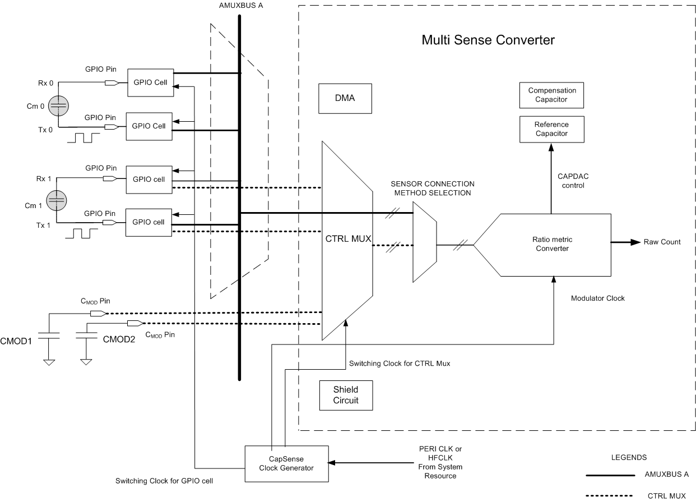

The PSoC 4100S Max device has two instances of MSC: Channel 0 and Channel 1. Each channel is connected to 16 dedicated Control MUX pins. The sensors could be either interfaced to any supported GPIO pins as in legacy CapSense or dedicated Control MUX pins as shown in Figure 1. Thus, the device can support more than 32 sensors: the 32 sensors connected to dedicated Control MUX pins can be used in autonomous scan mode with the help of DMA, and the sensors connected to other GPIO pins supported by interrupt-driven scan mode through AMUXBUS.

For each MSC channel, there are two external C<sub>MOD</sub> capacitors connected to dedicated CMOD pins in the device. The MSC block in the device helps to simultaneously scan two sensors in a single scan slot using two channels. See **Step 5** (*Select the pins and scan slot using the Scan Configuration tab*) of [Stage 1](#stage-1-set-initial-hardware-parameters) for more details.

The ratiometric converter gives an equivalent raw count which is proportional to the sensor mutual capacitance after each scan according to the following equation:

**Equation 1. CSX-RM Raw Count**


Where,

N<sub>sub</sub>  - Number of sub-conversions

C<sub>m</sub> - Mutual capacitance of the sensor

CompClk<sub>Div</sub> - CDAC Compensation divider

TxClk<sub>Div</sub> - Tx clock divider

C<sub>comp</sub> - Compensation Capacitance

C<sub>ref</sub> - Reference Capacitance

The MSC block has two internal capacitor DACs: a reference capacitor DAC, and a compensation capacitor DAC which replaces the IDAC in the previous generation CapSense technology. The usage of CAPDACs in the MSC is similar to IDAC in the legacy CapSense technology. These CAPDACs are switched onto the external C<sub>MOD</sub> capacitor multiple times during a modulator clock period to find out the equivalent raw count that is proportional to the mutual capacitance of the sensor. The number of times the reference capacitor is switched with respect to the modulator clock is denoted by the Tx clock divider value according to the following equation:

**Equation 2. Tx Clock Divider**


The compensation capacitor is used to compensate excess mutual capacitance from the sensor to increase the sensitivity. The number of times it is switched depends on the amount of charge the user application is trying to compensate (remove) from the sensor mutual capacitance. The number of times the compensation capacitor is switched with respect to the modulator clock is denoted by the value of the CDAC compensation divider according to the following equation. The CDAC compensation clock divider must be less than or equal to the Tx clock divider.

**Equation 3. CDAC Compensation Divider**


There are two phases in charge and discharge of the Tx electrode as shown in Figure 2. The maximum Tx clock frequency should be selected such that the sensor will charge and discharge the Tx and Rx electrode completely. Figure 2 shows an example Tx electrode waveform.

**Figure 2. Sensor Waveform of CSX-RM Sensing Method**


## Code Example Overview

This code example provides the following:

   1. A high-level overview of the CSX-RM widget tuning flow.

   2. An example to show how to manually tune a CSX-RM button widget.

   3. Details on how to use the CapSense Tuner available in ModusToolbox to monitor the CapSense raw data and fine-tune the CSX-RM button for optimum performance such as reliability, power consumption, and response time.

The firmware scans two mutual capacitance button widgets in the kit configured in MSC CSX-RM sensing mode. Initial CapSense hardware parameters are fixed with the [Procedure for CSX-RM Button Tuning](#procedure-for-csx-rm-button-tuning) using the **CapSense Configurator** in ModusToolbox.

The firmware also sends the CapSense raw data to the PC which could be received using the CapSense Tuner. The tuning of the button is performed with the help of the data that is received in the CapSense Tuner. The successful tuning of the button is indicated by LEDs in the pioneer kit: the LED is turned ON when the finger touches the button and turned OFF when the finger is removed from the button. See the [Design and Implementation](#design-and-implementation) section for more details.


## Overview of Button Tuning

The following flowchart gives a high-level summary on how to tune a MSC CSX based mutual capacitance button in PSoC 4 devices.

**Figure 3. High-Level Overview of MSC CSX Button Tuning**


## Procedure for CSX-RM Button Tuning

Tuning of the CSX-RM button involves the following stages:

- [Stage 1: Set Initial Hardware Parameters](#stage-1-set-initial-hardware-parameters)

- [Stage 2: Use CapSense Tuner for SNR Measurement](#stage-2-use-capSense-tuner-for-snr-measurement)

- [Stage 3: Modify Hardware Parameters or Adjust Filter Settings](#stage-3-modify-hardware-parameters-or-adjust-filter-settings)

- [Stage 4: Set the Software Threshold Parameters Using CapSense Tuner](#stage-4-set-the-software-threshold-parameters-using-capsense-tuner)


### Stage 1: Set Initial Hardware Parameters
----------------------

1. Connect the board to your PC using the provided micro USB cable through the KitProg3 USB connector.

2. Launch the **CapSense Configurator**. See the "Launch the CapSense Configurator" section from the [ModusToolbox CapSense Configurator Guide](https://www.cypress.com/file/492896/download).

   In the **Basics** tab, you will find two widget ‘Button0’ and 'Button1' configured as mutual-capacitance buttons with CSX-RM sensing mode, and CSX tuning mode selected as *Manual Tuning* method.

   **Figure 4. CapSense Configurator - General Settings**

   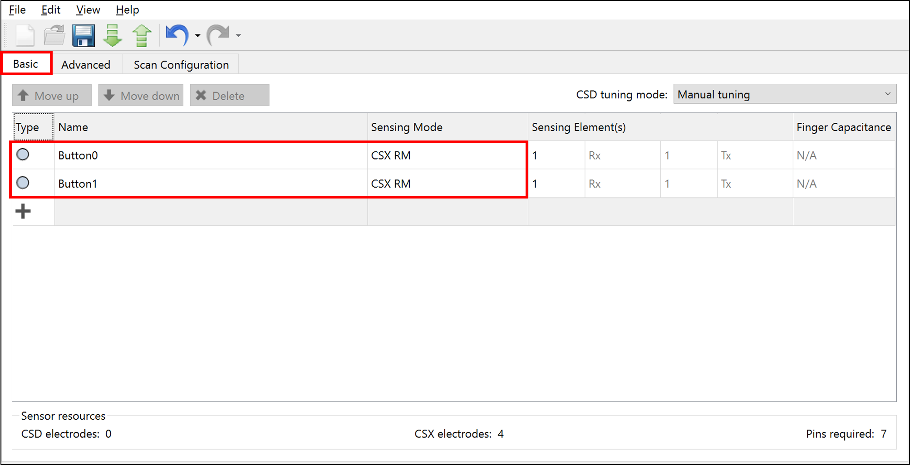

3. Set the initial general parameters.

   1. Navigate to the **Advanced** tab, and then select the **General settings** sub-tab. Leave all the filter parameters at their default settings. Filters will be enabled depending on the SNR and system time requirements. The parameters like Scan mode, sensor connection method in the General tab does not have any impact on the tuning procedure.

      **Figure 5. CapSense Configurator - General Settings**

      

      **Table 1. Advanced Tab - General Settings**

      | Parameter | Value | Remarks |
      | --- | --- | --- |
      |Scan mode|INT Driven| Select from the following: <br /> **CS-DMA mode:** Automated scan using DMA; this is helpful for scanning multiple sensors autonomously and offloading the CPU. This mode requires dedicated Control MUX pins.  <br />**INT Driven mode:** Uses CPU bandwidth for setting scan configuration and data transfer|
      |Sensor Connection Method|CTRLMUX| Select from the following: <br />**AMUXBUS method:** Allows any supported GPIOs to be used as a sensor. <br />**CTRLMUX method:** Only selected GPIO Pins are available as sensors. This mode allows MSC to control the GPIO pins.|
      | Modulator clock divider | 2  | A higher modulator clock frequency improves linearity and increases measurement accuracy and sensitivity. Lower modulator clock frequency helps to increase the CDAC values. |
      |Regular widget raw count filter & Baseline IIR filter settings |Disable filters|Filters are used to reduce the peak to peak noise. Using filters will result in higher response time.|

      **Notes:**
      - In this code example modulator clock frequency is set to 24MHz with 48 MHz as the IMO clock frequency. To modify the IMO clock frequency, go to the **System Tab** in the **Device Configurator** tool, select **System Clocks** > **Input** > **IMO**. Select 48 from the **Frequency(MHz)** drop-down list.

      - CS-DMA requires additional configuration of DMAC channels in the Device Configurator.


4. Set the initial hardware parameters.

   1. Select the **Advanced** tab and then select the **CSX Settings** sub-tab.
   2. Configure the parameters as Table 2 and Figure 6 show.

      **Figure 6. CapSense Configurator - Advanced CSX Settings**

      

       **Table 2. Advanced Tab - CSX Settings**

      | Parameter | Value | Remarks |
      | --- | --- | --- |
      | Enable CDAC auto-calibration | Checked | Enabling CDAC auto-calibration allows the device to automatically choose the optimal CDAC code such that it calibrates the raw count of the sensor to 40 percent of its maximum value.
      | Enable compensation CDAC | Unchecked | Enable this option to increase the sensitivity.|


   3. Set the Tx clock divider and Tx clock source.

      1. Navigate to the **Advanced** tab, and then select the **Widget Details** window.

         **Figure 7. Advanced Tab - Widget Details Sub-Tab**

         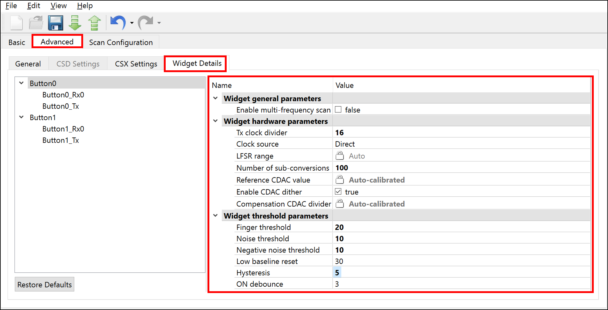

      2. Set the Tx clock divider and Tx clock source according to the following guidelines:

         - **Tx clock divider**

            CapSense configurator in ModusToolbox allows you to set the Tx clock frequency in terms of the Tx clock divider as shown in Equation 4:

            **Equation 4. Tx Clock Divider**

            

            Set the maximum possible Tx clock frequency that will completely charge and discharge the Tx and Rx electrode parasitic capacitance in each phase of the CSX-RM sensing method. Verify the charging and discharging of the sensor waveform with an oscilloscope by probing the sensor using an active probe.

            Use Equation 5 to compute the maximum Tx clock frequency using the C<sub>p</sub> of the Tx and Rx electrode, and the total series resistance R<sub>Series</sub>. If an LCR meter is not available, set some initial Tx clock divider and look at the charge and discharge waveform of the Tx/Rx electrode and try to iteratively change the Tx clock divider and set a maximum frequency such that it completely charges and discharges in each phase of the MSC CSX sensing method.

            **Equation 5. Maximum Tx Clock Frequency**

            

            Where C<sub>P_Tx</sub> and C<sub>P_Rx</sub> are the parasitic capacitances of the Tx and Rx electrodes respectively. Measure the C<sub>P</sub> of the Tx and Rx electrode of the button using an LCR meter. The C<sub>P</sub> should be measured between the Tx/Rx electrode (electrode pin) and the device ground.

            R<sub>Series_Cp_Tx</sub> and R<sub>Series_Cp_Rx</sub>is the total series resistance of the Tx and Rx electrodes respectively, which includes the 500-ohm pin internal resistance, external series resistance (in CY8CKIT-041S MAX, it is 2 kilo-ohm), and the trace resistance. Include the trace resistance if high-resistive material such as ITO, or conductive ink is used. The external resistor is connected between the sensor Tx/Rx electrode pad and the device pin to reduce the radiated emission. ESD protection is built into the device.

         - **Clock source:**

            Select **Direct** as the clock source. Spread Spectrum clock (SSC) or PRS clock can be used as a clock source to deal with EMI/EMC issues. The selected value should be set using the widget details tab in the CapSense configurator.

      3. Set the CDAC compensation divider

         CDAC compensation divider is used to set the clock that controls the C<sub>comp</sub>Ccomp capacitor. It must be less than or equal to the Tx clock divider. Set an initial value of 6.

         Note: This parameter is only effective when the compensation CDAC is enabled.

         **Equation 6. Compensation Clock Divider**

         

         The selected value should be set using the *Widget Details* tab in the CapSense Configurator.

      4. Ensure that the following conditions are also satisfied when selecting the Tx clock frequency and CDAC compensation divider:

         - The auto-calibrated CDAC and Compensation CDAC value should lie in the mid-range (for example, 6 - 200) for the selected sense clock divider and CDAC compensation divider. This should be verified once the initial hardware parameters are loaded into the device.. See **Step 2** (*Ensure that the auto-calibrated CDAC is within the recommended range*) of [Stage 2](#stage-2-use-capsense-tuner-for-snr-measurement) for more details.

         - If you are explicitly using the PRS or SSCx clock source, ensure that you select the Tx clock frequency that meets the conditions mentioned in the [ModusToolbox CapSense Configurator Guide](https://www.cypress.com/file/492896/download) in addition to the above condition. PRS and SSCx techniques will spread the frequency across a range. The maximum frequency set should charge and discharge the Tx/Rx electrode completely; this should be verified using an oscilloscope and an active probe.

         - If you want to scan Channel 0 and Channel 1 in the same scan slot simultaneously, the Tx clock divider and the number of sub-conversion should be the same for both buttons.

         The selected value should be set using the *Widget Details* tab in the CapSense Configurator.

         **Table 3. Tx Clock Divider Settings in Configurator**

         |Development Kit | Tx Cp (pF)|  Rx Cp (pF)| R<sub>SeriesTx/Rx</sub> (ohm) |  Maximum Tx clock frequency (kHz)| Tx Clock Divider Setting in Configurator|
         | --- | --- | --- | --- | --- |--- |
         |CY8CKIT-041S-MAX (Tx-P11.2, Rx-P0.1) | 21 |20  | 2.5k | 1905| 13|
         |CY8CKIT-041S-MAX (Tx-P0.3, Rx-P0.1) | 25 | 20 | 2.5k | 1600 | 15|


   4. Set the Number of sub-conversions.

      Set an initial number of sub-conversions to 100. The selected value should be set using the *Widget Details* tab in the CapSense Configurator. This will be modified in [Stage 3: Modify Hardware Parameters or Adjust Filter Settings](#stage-3-modify-hardware-parameters-or-adjust-filter-settings) based on the Signal-to-Noise ratio (SNR) and system timing requirements.

5. Select the channels, pins and scan slot using the *Scan Configuration* tab.

   In the [CY8CKIT-041S MAX kit](https://www.cypress.com/documentation/development-kitsboards/psoc-4100s-max-pioneer-kit-cy8ckit-041s-max), Button 0 Tx Pin P11[2] is connected to Channel 0, Button 1 Tx Pin P0[3] is connected to Channel 1, and the Rx pin pin P0[1] is connected to Channel 1, which is shared between Button 0 and Button 1. Ensure that you enable both Channel 0 and Channel 1 in the Device Configurator as shown below:

   **Figure 8. Enable MSC Channels in Device Configurator**

   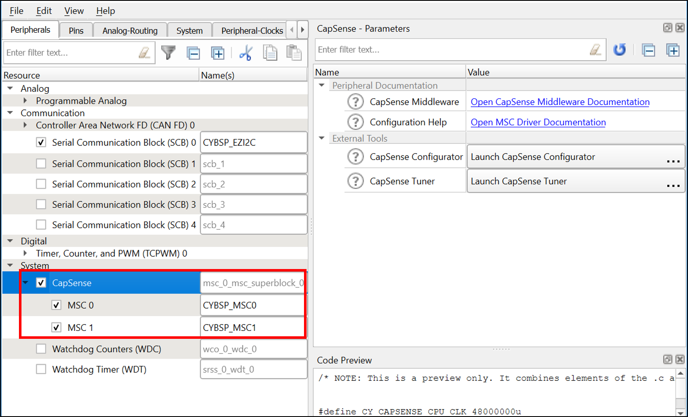

   This will enable configuring the parameters in the *Scan configuration* tab according to Table 4 and Table 5, and as shown in Figure 9.

   **Figure 9. Scan Configuration Tab**

   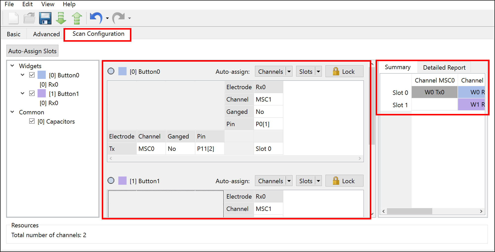

   The Ganged option allows you to share the pin with other sensor electrodes. The pin that has to be ganged should be selected from the list that appears in the selection box. Select **Dedicated pin** if the electrode needs dedicated pin. If the electrode needs to be shared with other electrodes from the same channel, select that particular pin from the list. Once the ganged option is selected, the **Pin** parameter shows the list of pins for selection if *Dedicated pin* is selected, and shows *Ganged* if the electrode pin is shared with other sensors.

   The summary section in the *Scan Configuration* tab is an indication of the distribution of scan of the sensor in each slot. Each slot allows simultaneous scanning of channel 0 and channel 1 if the Tx clock divider and the number of sub conversions are same.  The basic recommendation for slot selection is to enter the slot number applicable which might help in achieving less scan time by parallel scanning.

   In CSX-RM sensing method, the Rx pin is scanned for each button. In the [CY8CKIT-041S MAX kit](https://www.cypress.com/documentation/development-kitsboards/psoc-4100s-max-pioneer-kit-cy8ckit-041s-max), the Rx pin in channel 1 is shared between Button 0 and Button 1. Thus, the summary section in the *Scan Configuration* tab shows Channel 1 highlighted in Slot 0 and Slot 1 to show that only Channel 1 is scanned. Since Channel 1 must be scanned for both buttons, two slots are required to scan Button 0 and Button 1.

   The scan configuration tab also allows to select the pins for C<sub>mod</sub> capacitors for Channel 0 and Channel 1 through a drop down list. The default pin selection is shown in Table 6.

   **Table 4. Button 0 Scan Configuration**

   | Parameter | Button 0 Tx |Button 0 Rx | Remarks |
   | --- | --- | --- | --- |
   |Channel|00|01|Select the channel to which the pins are connected|
   |Ganged|No (Dedicated pin)|No (Dedicated pin)|**No:** The pin uses only a dedicated pin.<br /> **Yes:** The electrode pin is shared with other sensors. The pin should be selected from the list that appears when you select *Ganged*.|
   |Pin|P11[2]|P0[1]|Select the pin of the sensor electrode.|
   |Slot|Slot 0|| |

   **Table 5. Button 1 Scan Configuration**

   | Parameter | Button 1 Tx |Button 1 Rx | Remarks |
   | --- | --- | --- | --- |
   |Channel|01|01|Select the channel to which the pins is connected|
   |Ganged|No (Dedicated pin)|Yes (Button0_Rx0)|**No:** If the pin uses only a dedicated pin. <br /> **Yes:** If the electrode pin is shared with other sensors. The ganged pin should be selected from the list that appears when you select the *Ganged* option.|
   |Pin|P0[3]|Ganged|Select the sensor pin. Here, Button 0 Rx pin is shared with the Button 1 Rx pin.|
   |Slot|Slot 1||Because Button 0 is scanned in Slot 0, Button 1 can be scanned only in Slot 1.|

   **Table 6. Cmod Capacitor selection**

   | Parameter | Cmod1 | Cmod2 |
   | --- | --- | --- |
   |Channel 0 |P4[0]|P4[1]|
   |Channel 1 |P7[0]|P7[1]|

6. Program the board.

   - **Using Eclipse IDE for ModusToolbox:**

      1. Select the application project in the Project Explorer.

      2. In the **Quick Panel**, scroll down, and click **\<Application Name> Program (KitProg3_MiniProg4)**.


   - **Using CLI:**

     From the terminal, execute the `make program` command to build and program the application using the default toolchain to the default target. You can specify a target and toolchain manually:
      ```
      make program TARGET=<BSP> TOOLCHAIN=<toolchain>
      ```

      Example:
      ```
      make program TARGET=CY8CKIT-041-MAX TOOLCHAIN=GCC_ARM


### Stage 2: Use CapSense Tuner for SNR Measurement
-------------

1. Set up the CapSense Tuner to view the sensor data.

   1. Launch the CapSense Tuner.

      See the "Launch the CapSense Tuner" section from the [ModusToolbox CapSense Tuner Guide](https://www.cypress.com/file/504381/download).

   2. Go to **Tools** > **Tuner Communication Setup** and set the parameters as Figure 10 shows. Click **OK**.

      **Figure 10. Tuner Communication Setup**

      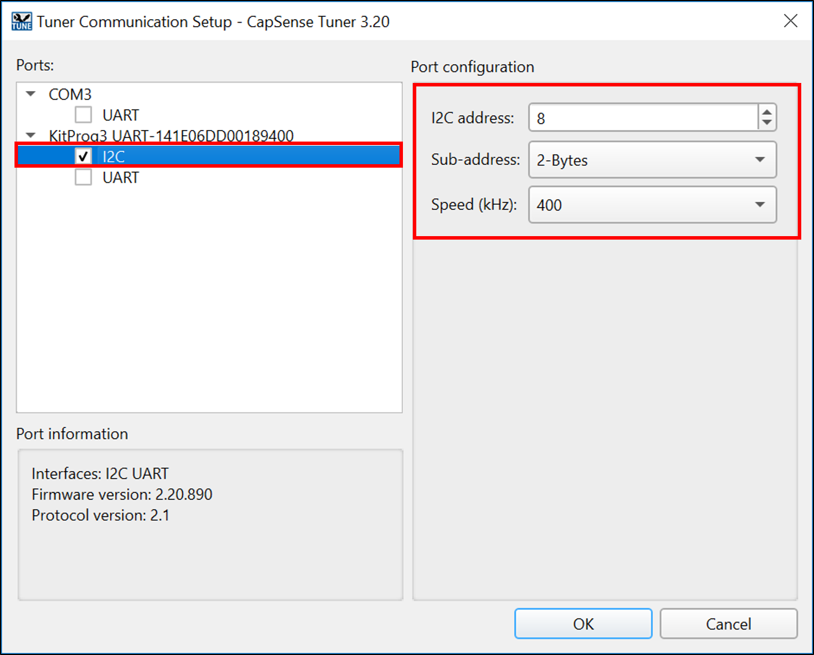

   3. Click **Connect**.

      **Figure 11. CapSense Tuner Window**

      

   4. Click **Start**.

      **Figure 12. CapSense Tuner Start**

      

      The *Widget/Sensor Parameters* tab gets updated with the parameters configured in the *CapSense Configurator* window.

      **Figure 13. CapSense Tuner Window**

      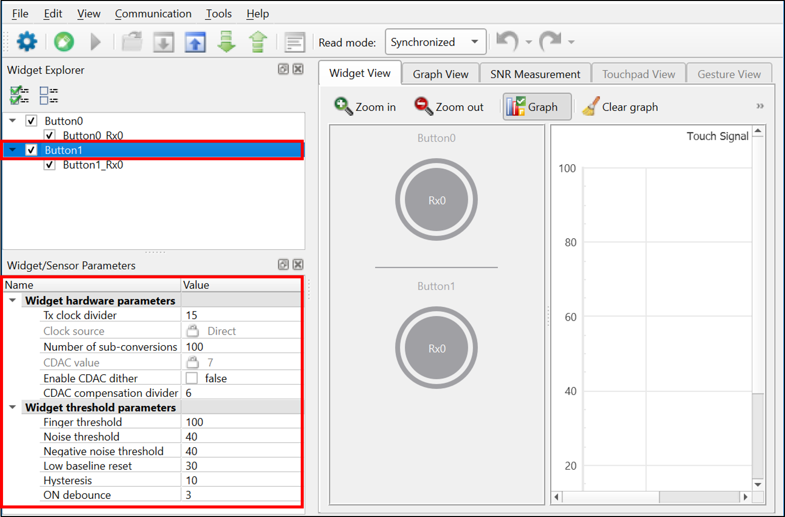

   5. Select **Button1** and **Synchronized** under **Read mode**, and then navigate to the **Graph View** as Figure 14 shows.

      The Graph View displays the raw counts and baseline for *Button1* in the *Sensor Data* window. Ensure that **Raw Counts** and **Baseline** checkboxes are selected to view the sensor data.

      **Figure 14. CapSense Tuner Graph View**

      

      **Note:** At this point, when the configured button is touched, you may or may not notice the touch signal in the **Sensor Signal** graph. The sensor may false-trigger, which can be seen in the touch status going from 0 to 1 in the **Status** window.

2. Ensure that the auto-calibrated CDAC is within the recommended range.

   As discussed in the previous section, the Tx clock frequency or CDAC compensation divider will be tuned to bring the CDAC value to the recommended range in this step. Click **Button1** in the **Widget Explorer** to view the CDAC values in the *Sensor Parameters* window as shown in Figure 15. If the CDAC values is within the range (6 to 200), the following step is not required.

   Per Equation 1, increasing the Tx clock divider value will decrease the CDAC value for a given calibration percent and vice versa. Increasing the CDAC compensation divider will increase the compensation CDAC value for a given calibration percent and vice versa.

   **Figure 15. CDAC Value**

   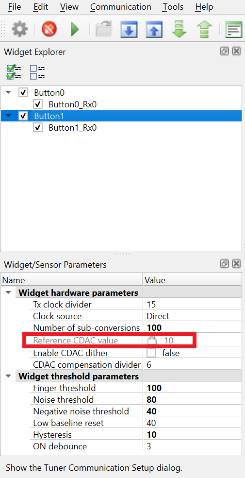

3. Fine-tune the Tx clock divider or CDAC compensation divider to bring the CDAC value within range.

   1. Click **Button1** in the Widget Explorer.

   2. Increase or decrease the Tx clock divider or CDAC compensation divider value in the *Widget Hardware Parameters* window.

   3. Click **To Device** to apply the changes to the device as shown in Figure 16.

      **Figure 16. Apply Changes to Device**

      

   4. Observe the CDAC value and compensation CDAC value in the *Sensor Parameters* section of the *Widget/Sensor Parameters* window.

   5. Repeat steps 1 to 4 until you obtain the CDAC value in the range of 6 to 200.

   **Note:** As Figure 15 shows, CDAC values are already in the recommended range. Therefore, you can leave the Tx clock divider to the value as shown in Table 3.

4. Measure SNR.

   1. Switch to the **SNR Measurement** tab, select the **Button1** sensor, and then click **Acquire Noise** as Figure 17 shows.

      **Figure 17. CapSense Tuner - SNR Measurement: Acquire Noise**

      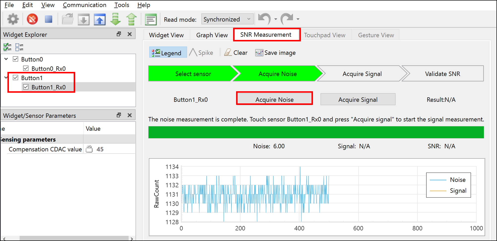

   2. Once the noise is acquired, touch the button on the kit, and then click **Acquire Signal**. Ensure that the finger remains on the button as long as the signal acquisition is in progress.

     The calculated SNR on this button is displayed, as Figure 18 shows. Based on your end-system design, test with a finger that matches the size of your normal use case. Typically, finger size targets are ~6 to 12 mm.

      **Figure 18. CapSense Tuner - SNR Measurement: Acquire Signal**

      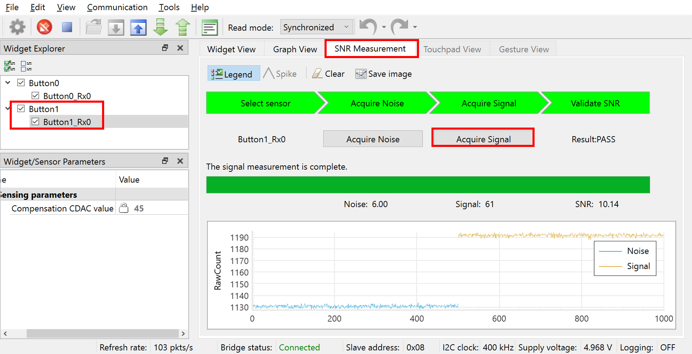


### Stage 3: Modify Hardware Parameters or Adjust Filter Settings
-----------------

Skip this stage if the following conditions are met:

- Measured SNR from the previous stage is greater than 5:1.

- Signal count is greater than 50.

- Response time requirement are met.

If the SNR is less than 5:1, do the following to increase the touch performance. The main parameters that influence SNR are the number of sub-conversions and use of filters.

It is best to find a balance between the resolution and filters to achieve proper overall tuning. If your system is very noisy (counts >20), you may want to prioritize adding a filter. On the other hand, if your system is relatively noise-free (counts <10), you should focus on the number of sub-conversions, because this will increase the sensitivity and signal of your system.


#### Number of Sub-conversions

The number of sub-conversions can be increased to increase signal at a disproportionate rate to noise to improve the overall SNR. Increasing the number of subconversions adds to the overall hardware scan time, based on Equation 7:

**Equation 7. Scan Time**


Do the following to update the number of sub-conversions:

1. Update the number of sub-conversion (N<sub>sub</sub>) directly in the **Widget/Sensor Parameters** tab of the CapSense Tuner.

2. Increase the number of sub-conversions by 20 and repeat **Step 4** (*Measure SNR*) of [Stage 2](#stage-2-use-capSense-tuner-for-snr-measurement) until the minimum SNR of 5:1 and at least a signal count greater than 50 are achieved.


#### Firmware Filters

Firmware filters help to reduce noise without increasing the signal. Based on your noise type, you can enable a filter to improve the SNR. Each filter will add additional processing time as well as memory use. If your system is very noisy (counts > 20), add a filter.


1. Open **CapSense Configurator** from ModusToolbox quick panel and select the appropriate filter:

   **Figure 19. Filter Settings in CapSense Configurator**

   

   **Note:**
   - Add the filter based on the type of noise in your measurements. See [ModusToolbox CapSense Configurator Guide](https://www.cypress.com/file/492896/download) for details.
   - The current example has SNR around 10:1; therefore, filters are not enabled.

2. Reprogram the device to update filter settings.

After setting the number of sub-conversions and filter settings, check the total scan time based on Equation 7 to determine whether system requirements are met. This timing will impact the response time, and is a crucial factor in the overall power consumption of the device in CapSense applications.

If the total sensor scan time meets your requirements, go to next step.

If not, adjust the tuning to speed up the scan time (decrease the Number of sub-conversions or increase the F<sub>Tx</sub>). If the SNR is greater than 10 on any sensor, lower the Number of sub-conversions or remove the filters to decrease the scan time, but keep the SNR greater than 5:1. It is best to find a balance between Number of sub-conversions and filters to achieve proper overall tuning.

### Stage 4: Set the Software Threshold Parameters Using CapSense Tuner
-----------------------

After you have confirmed that your design meets the timing parameters, and the SNR is greater than 5:1, set your threshold parameters as follows:

1. Switch to the **Graph View** tab and select **Button1**.

2. Touch the sensor and monitor the touch signal in the **Sensor Signal** graph.

   The **Sensor Signal** graph should display the signal as Figure 20 shows.

    Ensure that you observe the difference count (that is, the signal output) in the *Graph View* tab in Figure 18, not the raw count output for setting these thresholds. Based on your end system design, test the signal with a finger that matches the size of your normal use case. Consider testing with smaller sizes that should be rejected by the system to ensure that they do not reach the finger threshold. Also ensure to ground the metal finger.

   **Figure 20. Sensor Signal when the Sensor Is Touched**

   

3. When the signal is measured, set the thresholds according to the following recommendations:

   - Finger Threshold = 80 percent of signal

   - Noise Threshold = 40 percent of signal

   - Negative Noise Threshold = 40 percent of signal

   - Hysteresis = 10 percent of signal

   - Debounce = 3

4. Set the threshold parameters in the **Widget/Sensor Parameters** section of the CapSense Tuner.

   **Figure 21. Widget Threshold Parameters**

   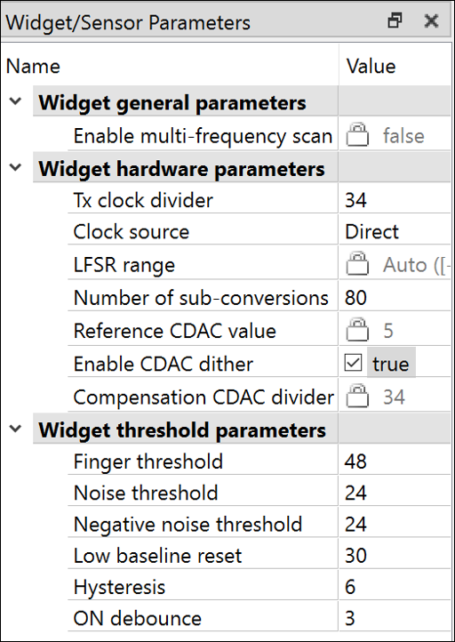

5. Apply the settings to the device and to the project by clicking **To Device** and then **To Project** as Figure 22 shows, and close the tuner.

   **Figure 22. Apply to Project Setting**

   

   If your sensor is tuned correctly, you will observe the touch status go from 0 to 1 in the **Status** sub-window of the **Graph View** window as Figure 23 shows. The successful tuning of the button is also indicated by a LED in the pioneer kit; the LED is turned ON when the finger touches the button, and turned OFF when the finger is removed.

   **Figure 23. Sensor Status in CapSense Tuner**

   

6. Launch **CapSense Configurator**. You should now see all the changes that you made in the CapSense Tuner reflected in the **CapSense Configurator**.

## Debugging

You can debug the example to step through the code. In the IDE, use the **\<Application Name> Debug (KitProg3_MiniProg4)** configuration in the **Quick Panel**. For more details, see the "Program and Debug" section in the [Eclipse IDE for ModusToolbox User Guide](https://www.cypress.com/MTBEclipseIDEUserGuide).


## Design and Implementation

The project contains two button widgets configured in CSX-RM sensing mode. See the [Procedure for CSX-RM Button tuning](#procedure-for-csx-rm-button-tuning) section for step-by-step instructions to configure the other settings of the **CapSense Configurator**.

The project uses the [CapSense Middleware](https://github.com/cypresssemiconductorco/capsense) (see ModusToolbox User Guide for more details on selecting a middleware). See [AN85951 – PSoC 4 and PSoC 6 MCU CapSense Design Guide](https://www.cypress.com/documentation/application-notes/an85951-psoc-4-and-psoc-6-mcu-capsense-design-guide) for more details on CapSense features and usage.

The [ModusToolbox software](https://www.cypress.com/products/modustoolbox-software-environment) provides a GUI-based tuner application for debugging and tuning the CapSense system. The *CapSense Tuner* application works with the EZI2C and UART communication interfaces. This project has an SCB block configured in EZI2C mode to establish communication with the on-board KitProg, which in turn enables reading the CapSense raw data by the CapSense Tuner. See [EZI2C - Peripheral Settings](#resources-and-settings).

The CapSense data structure that contains the CapSense raw data is exposed to the CapSense Tuner by setting up the I2C communication data buffer with the CapSense data structure. This enables the Tuner to access the CapSense raw data for tuning and debugging CapSense data.

The successful tuning of the button is indicated by a LED in the pioneer kit: the LED is turned ON when the finger touches the button, and turned OFF when the finger is removed from the button.

**Figure 24. Firmware Design**


#### **Steps to setup the VDDA supply voltage in device configurator**

- Open *Device configurator* from *quick panel* and select Systems tab. Set the VDDA value in the Power settings at places highlighted in below figure.

   **Figure 25. Set the VDDA supply in System tab in device configurator**

    

**Note**: [PSoC 4100S Max Pioneer Kit](https://www.cypress.com/documentation/development-kitsboards/psoc-4100s-max-pioneer-kit-cy8ckit-041s-max) have two onboard regulator 3.3V and 5V. To use 3.3V place the Jumper J10 at position 2 and 3. See the kit user guide for more details.

### Resources and Settings

**Figure 26. EZI2C settings**

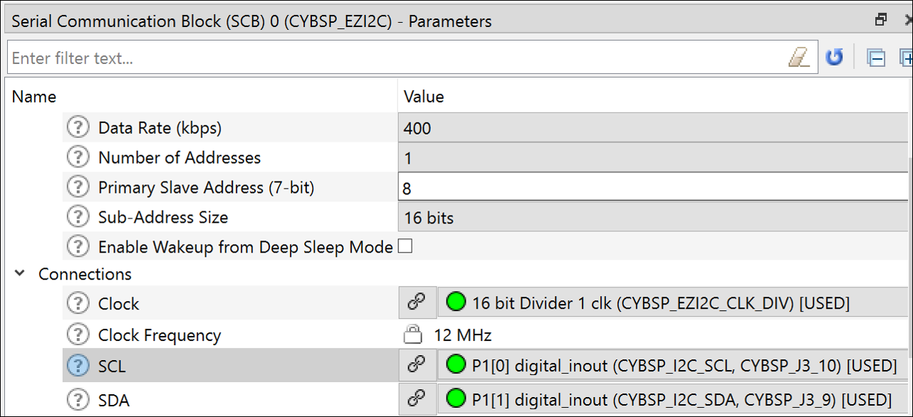

**Table 7. Application Resources**

| Resource  |  Alias/Object     |    Purpose     |
| :------- | :------------    | :------------ |
| SCB (I2C) (PDL) | CYBSP_EZI2C          | EZI2C slave driver to communicate with CapSense Tuner |
| CapSense | CYBSP_MSC0,CYBSP_MSC1 | CapSense driver to interact with the MSC hardware and interface the CapSense sensors |
| Digital Pin | CYBSP_LED_BTN0,CYBSP_LED_BTN1 | To show the button operation|

## Related Resources

| Application Notes                                            |                                                             |
| :----------------------------------------------------------- | :----------------------------------------------------------- |
| [AN79953](https://www.cypress.com/AN79953) – Getting Started with PSoC 4 | Describes PSoC 4 devices and how to build your first application with PSoC Creator |
| [AN85951](https://www.cypress.com/AN85951) – PSoC® 4 and PSoC® 6 MCU CapSense® Design Guide  | Describes how to design capacitive touch sensing applications with the PSoC 6 families of devices |
| **Device Documentation**                                               |
| [PSoC 4 Datasheets](https://www.cypress.com/search/all/PSOC%204%20datasheets?sort_by=search_api_relevance&f%5B0%5D=meta_type%3Atechnical_documents) | [PSoC 4 Technical Reference Manuals](https://www.cypress.com/search/all/PSoC%204%20Technical%20Reference%20Manual?sort_by=search_api_relevance&f%5B0%5D=meta_type%3Atechnical_documents) |
| **Code Examples**
| [Using ModusToolbox](https://github.com/cypresssemiconductorco/Code-Examples-for-ModusToolbox-Software) |
| **Development Kits**                                         | Buy at www.cypress.com                                       |
| [CY8CKIT-041S MAX](https://www.cypress.com/documentation/development-kitsboards/psoc-4100s-max-pioneer-kit-cy8ckit-041s-max) PSoC® 4100S Plus Prototyping Kit |
 **Libraries**                              |                                                           |
| PSoC 4 Peripheral Driver Library (PDL) and docs  | [psoc4pdl](https://github.com/cypresssemiconductorco/mtb-pdl-cat2) on GitHub |
| Cypress Hardware Abstraction Layer (HAL) Library and docs     | [psoc4hal](https://github.com/cypresssemiconductorco/mtb-hal-cat2) on GitHub |
| **Middleware**
| CapSense® library and docs                                    | [capsense](https://github.com/cypresssemiconductorco/capsense) on GitHub ||
**Tools**                                                    |                                                              |
| [Eclipse IDE for ModusToolbox](https://www.cypress.com/modustoolbox)     | The cross-platform, Eclipse-based IDE for IoT designers that supports application configuration and development targeting converged MCU and wireless systems.             |
| [PSoC Creator™](https://www.cypress.com/products/psoc-creator-integrated-design-environment-ide) | The Cypress IDE for PSoC and FM0+ MCU development.            |


## Other Resources

Cypress provides a wealth of data at www.cypress.com to help you select the right device, and quickly and effectively integrate it into your design.

## Document History

Document Title: *CE231079* - *PSoC 4: MSC CapSense CSX Button Tuning*

| Version | Description of Change |
| ------- | --------------------- |
| 1.0.0   | New code example. <br /> This version is not backward compatible with ModusToolbox software v2.1.      |

------

All other trademarks or registered trademarks referenced herein are the property of their respective owners.


-------------------------------------------------------------------------------

© Cypress Semiconductor Corporation, 2020. This document is the property of Cypress Semiconductor Corporation and its subsidiaries ("Cypress"). This document, including any software or firmware included or referenced in this document ("Software"), is owned by Cypress under the intellectual property laws and treaties of the United States and other countries worldwide. Cypress reserves all rights under such laws and treaties and does not, except as specifically stated in this paragraph, grant any license under its patents, copyrights, trademarks, or other intellectual property rights. If the Software is not accompanied by a license agreement and you do not otherwise have a written agreement with Cypress governing the use of the Software, then Cypress hereby grants you a personal, non-exclusive, nontransferable license (without the right to sublicense) (1) under its copyright rights in the Software (a) for Software provided in source code form, to modify and reproduce the Software solely for use with Cypress hardware products, only internally within your organization, and (b) to distribute the Software in binary code form externally to end users (either directly or indirectly through resellers and distributors), solely for use on Cypress hardware product units, and (2) under those claims of Cypress's patents that are infringed by the Software (as provided by Cypress, unmodified) to make, use, distribute, and import the Software solely for use with Cypress hardware products. Any other use, reproduction, modification, translation, or compilation of the Software is prohibited.
TO THE EXTENT PERMITTED BY APPLICABLE LAW, CYPRESS MAKES NO WARRANTY OF ANY KIND, EXPRESS OR IMPLIED, WITH REGARD TO THIS DOCUMENT OR ANY SOFTWARE OR ACCOMPANYING HARDWARE, INCLUDING, BUT NOT LIMITED TO, THE IMPLIED WARRANTIES OF MERCHANTABILITY AND FITNESS FOR A PARTICULAR PURPOSE. No computing device can be absolutely secure. Therefore, despite security measures implemented in Cypress hardware or software products, Cypress shall have no liability arising out of any security breach, such as unauthorized access to or use of a Cypress product. CYPRESS DOES NOT REPRESENT, WARRANT, OR GUARANTEE THAT CYPRESS PRODUCTS, OR SYSTEMS CREATED USING CYPRESS PRODUCTS, WILL BE FREE FROM CORRUPTION, ATTACK, VIRUSES, INTERFERENCE, HACKING, DATA LOSS OR THEFT, OR OTHER SECURITY INTRUSION (collectively, "Security Breach"). Cypress disclaims any liability relating to any Security Breach, and you shall and hereby do release Cypress from any claim, damage, or other liability arising from any Security Breach. In addition, the products described in these materials may contain design defects or errors known as errata which may cause the product to deviate from published specifications. To the extent permitted by applicable law, Cypress reserves the right to make changes to this document without further notice. Cypress does not assume any liability arising out of the application or use of any product or circuit described in this document. Any information provided in this document, including any sample design information or programming code, is provided only for reference purposes. It is the responsibility of the user of this document to properly design, program, and test the functionality and safety of any application made of this information and any resulting product. "High-Risk Device" means any device or system whose failure could cause personal injury, death, or property damage. Examples of High-Risk Devices are weapons, nuclear installations, surgical implants, and other medical devices. "Critical Component" means any component of a High-Risk Device whose failure to perform can be reasonably expected to cause, directly or indirectly, the failure of the High-Risk Device, or to affect its safety or effectiveness. Cypress is not liable, in whole or in part, and you shall and hereby do release Cypress from any claim, damage, or other liability arising from any use of a Cypress product as a Critical Component in a High-Risk Device. You shall indemnify and hold Cypress, its directors, officers, employees, agents, affiliates, distributors, and assigns harmless from and against all claims, costs, damages, and expenses, arising out of any claim, including claims for product liability, personal injury or death, or property damage arising from any use of a Cypress product as a Critical Component in a High-Risk Device. Cypress products are not intended or authorized for use as a Critical Component in any High-Risk Device except to the limited extent that (i) Cypress's published data sheet for the product explicitly states Cypress has qualified the product for use in a specific High-Risk Device, or (ii) Cypress has given you advance written authorization to use the product as a Critical Component in the specific High-Risk Device and you have signed a separate indemnification agreement.
Cypress, the Cypress logo, Spansion, the Spansion logo, and combinations thereof, WICED, PSoC, CapSense, EZ-USB, F-RAM, and Traveo are trademarks or registered trademarks of Cypress in the United States and other countries. For a more complete list of Cypress trademarks, visit cypress.com. Other names and brands may be claimed as property of their respective owners.
